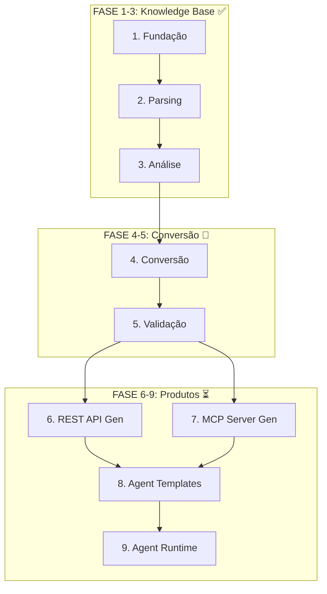

# WXCODE Master Plan

## Grafo de Dependências



## Status das Fases

| Fase | Nome | Status | Specs OpenSpec |
|------|------|--------|----------------|
| 1 | Fundação | ✅ Concluída | `project-management` |
| 2 | Parsing | ✅ Concluída | `schema-parsing`, `procedure-parsing`, `class-parsing`, `query-parsing`, `page-code-parsing` |
| 3 | Análise | ✅ Concluída | `dependency-analysis`, `neo4j-integration`, `control-matching`, `data-binding`, `hyperfile-*` |
| 4 | Conversão | 🔄 Em andamento | `schema-generator`, `domain-generator`, `service-generator`, `route-generator`, `template-generator`, `incremental-conversion` |
| 5 | Validação | ⏳ Pendente | - |
| 6 | REST API Generator | ⏳ Pendente | - |
| 7 | MCP Server Generator | ⏳ Pendente | - |
| 8 | AI Agent Templates | ⏳ Pendente | - |
| 9 | Agent Runtime | ⏳ Pendente | - |

---

## FASE 4: CONVERSÃO (Atual)

### Ordem Topológica de Conversão
```
1. Schema (tables → Pydantic models)
   └── spec: schema-generator
   
2. Domain (classes → Python classes)
   └── spec: domain-generator
   
3. Service (procedures → business logic)
   └── spec: service-generator
   
4. Route (pages → FastAPI routes)
   └── spec: route-generator
   
5. Template (pages → Jinja2 templates)
   └── spec: template-generator
```

### Changes em Andamento
| Change | Descrição | Dependência |
|--------|-----------|-------------|
| - | Nenhum change em andamento | - |

### Capabilities Recém-Adicionadas
| Capability | Descrição |
|------------|-----------|
| `incremental-conversion` | Conversão incremental via OpenSpec com `convert-next` |
| `llm-page-converter` | Conversor de páginas via LLM com `convert-page` |
| `llm-procedure-converter` | Conversor de procedures via LLM com `convert-procedure` |

### Próximos Changes (Fase 4)
1. `refine-template-generator` - Melhorar qualidade dos templates Jinja2
2. `add-conversion-validation` - Validar código gerado compila/executa
3. `add-equivalence-testing` - Comparar comportamento original vs convertido

---

## FASE 5: VALIDAÇÃO (Próxima)

### Capabilities Necessárias
```
1. Syntax Validation
   - Código Python gerado deve compilar
   - Templates Jinja2 devem renderizar
   
2. Runtime Validation
   - Rotas FastAPI devem responder
   - Services devem executar sem erro
   
3. Equivalence Testing
   - Input/output deve ser equivalente ao original
   - Casos de uso críticos documentados
```

### Changes Planejados
| Change | Prioridade | Descrição |
|--------|------------|-----------|
| `add-syntax-validator` | P0 | Valida código Python gerado |
| `add-template-validator` | P0 | Valida templates Jinja2 |
| `add-integration-tests` | P1 | Testes de integração end-to-end |
| `add-equivalence-checker` | P2 | Compara comportamento |

---

## FASE 6: REST API GENERATOR (Futuro)

### Objetivo
Gerar APIs REST standalone (sem UI) com OpenAPI spec automática.

### Capabilities Planejadas
- Modo API-only (ignora templates)
- OpenAPI 3.1 spec generation
- Swagger UI automático
- Autenticação JWT/OAuth2

---

## FASE 7: MCP SERVER GENERATOR (Futuro)

### Objetivo
Gerar MCP servers que expõem a lógica de negócio para AI agents.

### Capabilities Planejadas
- Um MCP server por domínio (clientes, pedidos, etc.)
- Tools CRUD automáticas
- Tools de relatório/consulta
- Documentação de tools para prompts

---

## FASE 8: AI AGENT TEMPLATES (Futuro)

### Objetivo
Gerar configurações prontas para AI agents baseados no conhecimento extraído.

### Capabilities Planejadas
- System prompts por perfil (suporte, vendas, BI)
- MCP configs pré-configurados
- Few-shot examples baseados em dados reais
- Regras de negócio extraídas automaticamente

---

## FASE 9: AGENT RUNTIME (Futuro)

### Objetivo
Plataforma para executar e gerenciar múltiplos AI agents.

### Capabilities Planejadas
- Orquestração de agents
- Multi-channel (WhatsApp, Email, Web Chat)
- Histórico de conversas
- Analytics de uso

---

## Como Usar Este Plano

### Para planejar próximo trabalho:
1. Identifique a fase atual
2. Verifique changes em andamento
3. Escolha próximo change da lista
4. Use `/openspec:proposal` para criar

### Para entender estado atual:
```bash
openspec list                    # Ver changes ativos
openspec show <change-id>        # Ver detalhes
ls openspec/specs/               # Ver capabilities documentadas
```

### Para adicionar nova fase:
1. Atualize este MASTER-PLAN.md
2. Crie specs iniciais em `openspec/specs/`
3. Crie primeiro change com `/openspec:proposal`

---

*Este documento define COMO e QUANDO. Para O QUE e POR QUÊ, veja [VISION.md](./VISION.md).*
*Para detalhes de implementação, veja as specs em `openspec/specs/`.*
